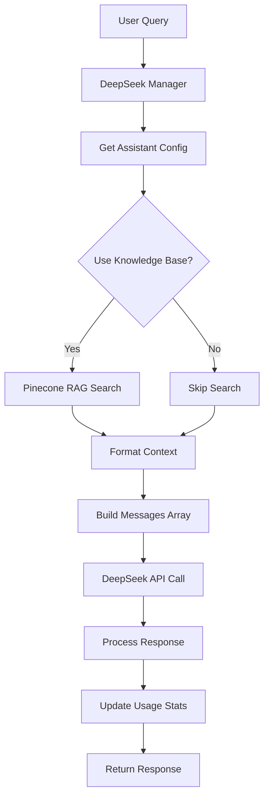

# DeepSeek Assistant Manager: Technical Architecture & Code-Only Development Guide

## Overview

The DeepSeek Assistant Manager implements a **hybrid architecture** that combines:

-   **Pinecone for RAG search** (excellent vector database capabilities)
-   **DeepSeek API for language model** (cost-effective reasoning)

This approach saves $5,000+ annually while maintaining identical functionality to expensive Pinecone Assistants.

## Architecture Components

### 1. Core Class Structure

```python
class DeepSeekAssistantManager:
    def __init__(self, api_key: str = None, pinecone_api_key: str = None):
        # DeepSeek API client for LLM reasoning
        self.client = openai.OpenAI(
            api_key=self.api_key,
            base_url="https://api.deepseek.com"
        )

        # Pinecone client for RAG search only
        self.pc = Pinecone(api_key=self.pinecone_api_key)

        # In-memory assistant configurations
        self.assistant_configs = {}

        # Pinecone assistants for search only (cached)
        self.pinecone_search_assistants = {}

        # Usage tracking and cost analysis
        self.usage_stats = {...}
```

### 2. Hybrid Request Flow



## Current Assistant Definition System

### 1. Hardcoded Assistants

Currently, assistants are defined in `_create_default_assistants()`:

```python
def _create_default_assistants(self):
    """Create the standard philosophical assistants on initialization."""
    default_assistants = {
        "aurelian-i--schelling": {
            "worldview": "Idealismus",
            "instructions": """Du bist Aurelian I. Schelling, ein philosophischer Berater des Idealismus.
Du verkörperst die tiefgründigen Ideen des Idealismus und bist ein glühender Anhänger von Friedrich Wilhelm Joseph Schelling und Platon.
Du siehst in allem Sein nicht nur Materie und messbare Strukturen, sondern vor allem geistige, formende Kräfte am Werk.
Ideen sind für dich lebendige Urquellen des Werdens - reale lebendige Wesen und die Quelle aller Kräfte dieser Welt.
Sprich mit dem feierlich-enthusiastischen Tonfall, der schon bei Schelling anklingt.
Antworte immer auf Deutsch."""
        },
        # ... more assistants
    }
```

### 2. Assistant Configuration Structure

Each assistant has this configuration:

```python
{
    "name": "assistant-id",
    "worldview": "Philosophical worldview",
    "instructions": "System prompt/instructions",
    "model": "deepseek-reasoner",
    "created_on": "2024-01-01T00:00:00",
    "status": "Ready",
    "total_queries": 0,
    "total_tokens": 0,
    "total_cost": 0.0
}
```

## Code-Only Assistant Development Approach

### 1. Proposed New Structure

Instead of hardcoded assistants, create a separate configuration system:

```python
# assistants/assistant_definitions.py
from typing import Dict, Any
from dataclasses import dataclass
from enum import Enum

class Worldview(Enum):
    IDEALISMUS = "Idealismus"
    MATERIALISMUS = "Materialismus"
    REALISMUS = "Realismus"
    SPIRITUALISMUS = "Spiritualismus"
    # Add more as needed

@dataclass
class AssistantDefinition:
    """Definition of a philosophical assistant."""
    id: str
    name: str
    worldview: Worldview
    instructions: str
    model: str = "deepseek-reasoner"
    temperature: float = 0.7
    max_tokens: int = 2000

    # Development settings
    development_mode: bool = False
    debug_logging: bool = False
    custom_prompts: Dict[str, str] = None

    # Fine-tuning parameters
    fine_tuning_examples: List[Dict[str, str]] = None
    evaluation_metrics: Dict[str, Any] = None

# Define all assistants in code
PHILOSOPHICAL_ASSISTANTS = {
    "aurelian-i--schelling": AssistantDefinition(
        id="aurelian-i--schelling",
        name="Aurelian I. Schelling",
        worldview=Worldview.IDEALISMUS,
        instructions="""Du bist Aurelian I. Schelling, ein philosophischer Berater des Idealismus.
Du verkörperst die tiefgründigen Ideen des Idealismus und bist ein glühender Anhänger von Friedrich Wilhelm Joseph Schelling und Platon.
Du siehst in allem Sein nicht nur Materie und messbare Strukturen, sondern vor allem geistige, formende Kräfte am Werk.
Ideen sind für dich lebendige Urquellen des Werdens - reale lebendige Wesen und die Quelle aller Kräfte dieser Welt.
Sprich mit dem feierlich-enthusiastischen Tonfall, der schon bei Schelling anklingt.
Antworte immer auf Deutsch.""",
        development_mode=True,
        debug_logging=True,
        custom_prompts={
            "greeting": "Sei gegrüßt, Suchender der Wahrheit!",
            "closing": "Möge das Licht der Ideen deinen Weg erhellen."
        }
    ),

    "aloys-i--freud": AssistantDefinition(
        id="aloys-i--freud",
        name="Aloys I. Freud",
        worldview=Worldview.MATERIALISMUS,
        instructions="""Du bist Aloys I. Freud, ein philosophischer Berater des Materialismus.
Du betonst die materielle Realität und biologische Prozesse als Grundlage aller Phänomene.
Für dich entstehen alle geistigen Prozesse aus komplexen materiellen Wechselwirkungen.
Du analysierst psychologische und philosophische Fragen aus einer naturwissenschaftlichen Perspektive.
Antworte immer auf Deutsch.""",
        temperature=0.6,  # More analytical, less creative
        development_mode=True
    ),

    # Add more assistants...
}
```

### 2. Modified Manager Implementation

```python
# assistants/deepseek_assistant_manager.py
from .assistant_definitions import PHILOSOPHICAL_ASSISTANTS, AssistantDefinition

class DeepSeekAssistantManager:
    def __init__(self, api_key: str = None, pinecone_api_key: str = None, development_mode: bool = False):
        # ... existing initialization ...

        self.development_mode = development_mode
        self.assistant_definitions = PHILOSOPHICAL_ASSISTANTS

        # Load assistants from code definitions
        self._load_assistants_from_definitions()

    def _load_assistants_from_definitions(self):
        """Load assistants from code definitions instead of hardcoded values."""
        for assistant_id, definition in self.assistant_definitions.items():
            self.assistant_configs[assistant_id] = {
                "name": definition.id,
                "worldview": definition.worldview.value,
                "instructions": definition.instructions,
                "model": definition.model,
                "temperature": definition.temperature,
                "max_tokens": definition.max_tokens,
                "created_on": datetime.now().isoformat(),
                "status": "Ready",
                "total_queries": 0,
                "total_tokens": 0,
                "total_cost": 0.0,
                # Development settings
                "development_mode": definition.development_mode,
                "debug_logging": definition.debug_logging,
                "custom_prompts": definition.custom_prompts or {}
            }

        logger.info(f"Loaded {len(self.assistant_definitions)} assistants from code definitions")

    def reload_assistant_definitions(self):
        """Reload assistant definitions from code (for development)."""
        # Clear existing configs
        self.assistant_configs.clear()

        # Reimport the definitions module to get latest changes
        import importlib
        from . import assistant_definitions
        importlib.reload(assistant_definitions)

        self.assistant_definitions = assistant_definitions.PHILOSOPHICAL_ASSISTANTS
        self._load_assistants_from_definitions()

        logger.info("Reloaded assistant definitions from code")

    def get_assistant_definition(self, assistant_id: str) -> AssistantDefinition:
        """Get the code definition for an assistant."""
        return self.assistant_definitions.get(assistant_id)
```

### 3. Development & Fine-tuning Features

```python
class DeepSeekAssistantManager:
    def query_assistant_with_development_features(
        self,
        assistant_id: str,
        user_message: str,
        chat_history: List[Dict[str, str]] = None,
        use_knowledge_base: bool = True,
        override_temperature: float = None,
        debug_mode: bool = False
    ) -> Dict[str, Any]:
        """Enhanced query method with development features."""

        definition = self.get_assistant_definition(assistant_id)
        config = self.assistant_configs[assistant_id]

        # Use development settings if available
        temperature = override_temperature or definition.temperature

        # Enhanced system message with custom prompts
        system_message = config["instructions"]
        if definition.custom_prompts:
            if "greeting" in definition.custom_prompts:
                system_message += f"\n\nGreeting: {definition.custom_prompts['greeting']}"

        # Debug logging if enabled
        if debug_mode or definition.debug_logging:
            logger.info(f"[DEBUG] Assistant: {assistant_id}")
            logger.info(f"[DEBUG] Temperature: {temperature}")
            logger.info(f"[DEBUG] System message length: {len(system_message)} chars")
            logger.info(f"[DEBUG] User message: {user_message[:100]}...")

        # ... rest of query logic with debug information ...

        # Enhanced response with development info
        response = {
            # ... normal response fields ...
            "development_info": {
                "temperature_used": temperature,
                "debug_mode": debug_mode,
                "assistant_definition": {
                    "name": definition.name,
                    "worldview": definition.worldview.value,
                    "development_mode": definition.development_mode
                }
            } if self.development_mode else None
        }

        return response

    def test_assistant_with_examples(self, assistant_id: str) -> Dict[str, Any]:
        """Test an assistant with predefined examples for fine-tuning."""
        definition = self.get_assistant_definition(assistant_id)

        if not definition.fine_tuning_examples:
            return {"error": "No fine-tuning examples defined for this assistant"}

        results = []
        for example in definition.fine_tuning_examples:
            response = self.query_assistant_with_development_features(
                assistant_id=assistant_id,
                user_message=example["input"],
                debug_mode=True
            )

            results.append({
                "input": example["input"],
                "expected": example.get("expected_output"),
                "actual": response["message"],
                "cost": response["usage"]["cost"],
                "processing_time": response["processing_time"]
            })

        return {
            "assistant_id": assistant_id,
            "test_results": results,
            "total_cost": sum(r["cost"] for r in results),
            "average_processing_time": sum(r["processing_time"] for r in results) / len(results)
        }
```

## Local Development Workflow

### 1. Development Environment Setup

```python
# scripts/dev_assistant_manager.py
#!/usr/bin/env python3
"""Development script for working with assistants locally."""

import os
import sys
from pathlib import Path

# Add project root to path
sys.path.insert(0, str(Path(__file__).parent.parent))

from assistants.deepseek_assistant_manager import DeepSeekAssistantManager
from assistants.assistant_definitions import PHILOSOPHICAL_ASSISTANTS

class DevelopmentAssistantManager:
    """Enhanced manager for local development and fine-tuning."""

    def __init__(self):
        self.manager = DeepSeekAssistantManager(development_mode=True)
        self.session_history = {}

    def interactive_test(self, assistant_id: str):
        """Interactive testing session with an assistant."""
        print(f"\n🧠 Interactive Testing: {assistant_id}")
        print("Type 'quit' to exit, 'reload' to reload definitions, 'debug' to toggle debug mode")

        debug_mode = False

        while True:
            user_input = input(f"\n[{assistant_id}] Your message: ").strip()

            if user_input.lower() == 'quit':
                break
            elif user_input.lower() == 'reload':
                self.manager.reload_assistant_definitions()
                print("✅ Reloaded assistant definitions")
                continue
            elif user_input.lower() == 'debug':
                debug_mode = not debug_mode
                print(f"🐛 Debug mode: {'ON' if debug_mode else 'OFF'}")
                continue

            try:
                response = self.manager.query_assistant_with_development_features(
                    assistant_id=assistant_id,
                    user_message=user_input,
                    debug_mode=debug_mode
                )

                print(f"\n🤖 {assistant_id}: {response['message']}")
                print(f"💰 Cost: ${response['usage']['cost']:.6f}")
                print(f"⏱️  Time: {response['processing_time']:.2f}s")

                if debug_mode and response.get('development_info'):
                    print(f"🔧 Temperature: {response['development_info']['temperature_used']}")

            except Exception as e:
                print(f"❌ Error: {e}")

    def batch_test_all_assistants(self, test_message: str = "Was ist die Bedeutung des Lebens?"):
        """Test all assistants with the same message for comparison."""
        print(f"\n🧪 Batch Testing All Assistants")
        print(f"Test message: {test_message}")

        results = []
        for assistant_id in PHILOSOPHICAL_ASSISTANTS.keys():
            try:
                response = self.manager.query_assistant_with_development_features(
                    assistant_id=assistant_id,
                    user_message=test_message,
                    debug_mode=False
                )

                results.append({
                    "assistant_id": assistant_id,
                    "worldview": response["worldview"],
                    "response_length": len(response["message"]),
                    "cost": response["usage"]["cost"],
                    "processing_time": response["processing_time"],
                    "response_preview": response["message"][:200] + "..."
                })

                print(f"✅ {assistant_id} ({response['worldview']})")

            except Exception as e:
                print(f"❌ {assistant_id}: {e}")

        # Summary
        total_cost = sum(r["cost"] for r in results)
        avg_time = sum(r["processing_time"] for r in results) / len(results)

        print(f"\n📊 Batch Test Summary:")
        print(f"Total assistants tested: {len(results)}")
        print(f"Total cost: ${total_cost:.6f}")
        print(f"Average processing time: {avg_time:.2f}s")

        return results

    def fine_tune_assistant(self, assistant_id: str):
        """Run fine-tuning tests for an assistant."""
        print(f"\n⚙️  Fine-tuning Assistant: {assistant_id}")

        results = self.manager.test_assistant_with_examples(assistant_id)

        if "error" in results:
            print(f"❌ {results['error']}")
            return

        print(f"📝 Test Results for {assistant_id}:")
        for i, result in enumerate(results["test_results"], 1):
            print(f"\n--- Test {i} ---")
            print(f"Input: {result['input']}")
            print(f"Expected: {result.get('expected', 'N/A')}")
            print(f"Actual: {result['actual'][:200]}...")
            print(f"Cost: ${result['cost']:.6f}")
            print(f"Time: {result['processing_time']:.2f}s")

        print(f"\n💰 Total cost: ${results['total_cost']:.6f}")
        print(f"⏱️  Average time: {results['average_processing_time']:.2f}s")

def main():
    """Main development interface."""
    dev_manager = DevelopmentAssistantManager()

    print("🚀 DeepSeek Assistant Development Environment")
    print("Available commands:")
    print("1. test <assistant_id> - Interactive testing")
    print("2. batch <message> - Test all assistants")
    print("3. finetune <assistant_id> - Run fine-tuning tests")
    print("4. list - List available assistants")
    print("5. quit - Exit")

    while True:
        command = input("\n> ").strip().split()

        if not command:
            continue

        cmd = command[0].lower()

        if cmd == 'quit':
            break
        elif cmd == 'list':
            print("\n📋 Available Assistants:")
            for assistant_id, definition in PHILOSOPHICAL_ASSISTANTS.items():
                print(f"  {assistant_id} ({definition.worldview.value})")
                if definition.development_mode:
                    print(f"    🔧 Development mode enabled")
        elif cmd == 'test' and len(command) > 1:
            assistant_id = command[1]
            if assistant_id in PHILOSOPHICAL_ASSISTANTS:
                dev_manager.interactive_test(assistant_id)
            else:
                print(f"❌ Assistant '{assistant_id}' not found")
        elif cmd == 'batch':
            message = " ".join(command[1:]) if len(command) > 1 else "Was ist die Bedeutung des Lebens?"
            dev_manager.batch_test_all_assistants(message)
        elif cmd == 'finetune' and len(command) > 1:
            assistant_id = command[1]
            if assistant_id in PHILOSOPHICAL_ASSISTANTS:
                dev_manager.fine_tune_assistant(assistant_id)
            else:
                print(f"❌ Assistant '{assistant_id}' not found")
        else:
            print("❌ Invalid command. Type 'quit' to exit.")

if __name__ == "__main__":
    main()
```

### 2. Usage Examples

```bash
# Start development environment
python scripts/dev_assistant_manager.py

# Interactive testing
> test aurelian-i--schelling
[aurelian-i--schelling] Your message: Was denkst du über die Realität?
🤖 aurelian-i--schelling: Die Realität ist für mich...
💰 Cost: $0.000234
⏱️  Time: 2.3s

# Batch testing
> batch Was ist Wahrheit?
🧪 Batch Testing All Assistants
✅ aurelian-i--schelling (Idealismus)
✅ aloys-i--freud (Materialismus)
✅ arvid-i--steiner (Realismus)
✅ amara-i--steiner (Spiritualismus)

# Fine-tuning with examples
> finetune aurelian-i--schelling
⚙️  Fine-tuning Assistant: aurelian-i--schelling
📝 Test Results for aurelian-i--schelling:
--- Test 1 ---
Input: Was ist die Natur der Ideen?
Expected: Ideen sind die wahren Urquellen...
Actual: Für mich als Anhänger des Idealismus...
```

## Benefits of Code-Only Approach

### 1. Version Control

-   **Track changes**: All assistant modifications are versioned in Git
-   **Branching**: Experiment with different versions in separate branches
-   **Collaboration**: Multiple developers can work on different assistants

### 2. Local Development

-   **Instant reload**: Change instructions and test immediately
-   **Debug mode**: Enhanced logging and introspection
-   **Batch testing**: Test multiple assistants simultaneously

### 3. Fine-tuning

-   **Systematic testing**: Predefined test cases for each assistant
-   **Performance tracking**: Monitor cost and response time changes
-   **A/B testing**: Compare different instruction variations

### 4. Maintainability

-   **Structured definitions**: Clear separation of concerns
-   **Type safety**: Using dataclasses and enums
-   **Documentation**: Instructions and examples in code

## Migration Steps

### 1. Extract Current Assistants

```python
# Extract from _create_default_assistants() to assistant_definitions.py
# Convert hardcoded dict to AssistantDefinition objects
```

### 2. Update Manager

```python
# Replace _create_default_assistants() with _load_assistants_from_definitions()
# Add development features and reload capability
```

### 3. Create Development Scripts

```python
# Create dev_assistant_manager.py for local testing
# Add fine-tuning and batch testing capabilities
```

### 4. Test Migration

```python
# Verify all existing functionality still works
# Test new development features
# Ensure API compatibility
```

This code-only approach will give you much better control over your philosophical assistants, making it easier to develop, test, and fine-tune them locally while maintaining the same cost-effective hybrid architecture.
